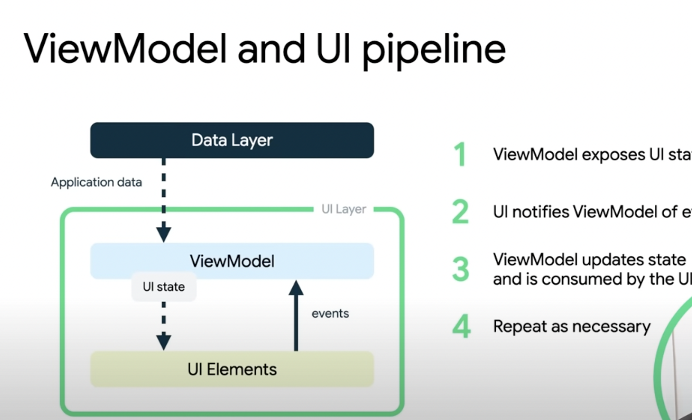

# Road to Android

## Projects
  
- [Support All Screen Sizes in Jetpack Compose](https://github.com/zprima/compose-adaptive)
- sorting vizualizer
- matrix character downfall animation
- solar system (animated)
- ToDo app
- webpage parser
- flowr spot mobile (full)
- clock (digital & analog)
- alarm (background trigger)
- weather app
- pokemon list app
- trips app
- calendar app (to show work free days)
   
## Links
- Android UI Layer explained: https://youtu.be/p9VR8KbmzEE

- [TheAndroidShow](https://www.youtube.com/hashtag/theandroidshow)
